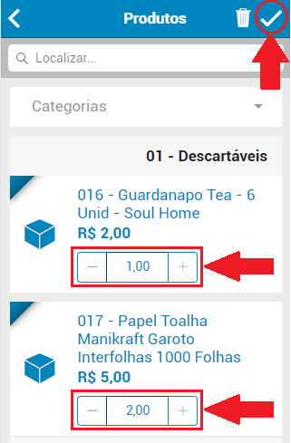

# Emissão do pedido

Para realizar um pedido é necessário:

1. Na tela principal do sistema é necessário clicar no botão de inclusão de um novo pedido

2. Deve ser selecionado o cliente que deseja realizar o pedido

3. Preencher os dados da aba **Geral** e selecionar a aba **Itens**, em seguida clicar no botão para inserção de itens

4. Selecione os itens que deseja adicionar ao pedido, informando a quantidade necessária.

5. Selecione a aba **Resumo**, verifique se os dados estão corretos e confirme o pedido

6. Após o pedido estar confirmado selecione a opção sincronizar para transmitir os dados armazenados no dispositivo, selecionando uma das opções abaixo

